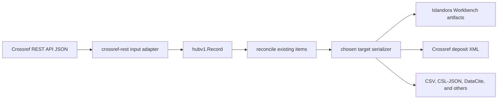
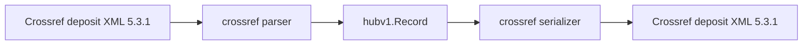

# Architecture

## Hub and spokes

Every metadata conversion passes through the same typed Hub record. A format
adapter is a spoke: a parser maps its wire representation into `hubv1.Record`,
and a serializer maps a Hub record to its target representation. A format may
support one or both directions.

The Hub keeps field semantics in one place and avoids a separate pairwise
converter for every source/target combination. It also provides a validation
checkpoint before reconciliation and serialization. Source-specific data that
cannot be represented canonically may be retained in `Record.Extra` with its
source provenance.

## Processing stages

The main stages are deliberately separate:

1. **Acquire**: a bounded source client retrieves a remote response or an
   operator supplies a local export.
2. **Parse**: the source adapter turns that response into Hub records.
3. **Validate**: Hub invariants and identifier authority are checked.
4. **Reconcile**: optional identifier-first and metadata-fallback comparison
   classifies records without changing a repository.
5. **Serialize**: the selected target adapter writes metadata or a deterministic
   artifact plan.
6. **Operate**: an external operator such as sitectl uploads artifacts or runs
   repository jobs.

Crosswalk may acquire scholarly discovery metadata from bounded public/vendor
APIs, but repository discovery and mutation remain outside the metadata model.
For Drupal/Islandora, sitectl acquires active `config/sync` and supplies the
resolved JSON:API endpoint; Crosswalk compiles the model, mappings, identity
rules, and output contract. Sitectl-isle validates and executes the resulting
Workbench artifact bundle.

## Models, profiles, and specifications

These contracts solve different problems:

| Contract | Purpose | Trust boundary |
|---|---|---|
| Hub schema | Canonical scholarly metadata types | Versioned Protocol Buffers in `hub/v1` |
| Model | Fields available in one configured external system | Content-addressed snapshot fingerprint |
| Profile | Ordered mappings and institution-specific identity policy | Bound to one exact model fingerprint |
| Transformation spec | Directional tabular fields and operational artifact policy | Sealed policy fingerprint; optionally bound to exact profile and model fingerprints |
| Artifact contract | Independently provisioned sitectl trust anchor | Built only from a reviewed sealed spec and its exact profile |

Models and profiles are needed when an external system's schema varies by
installation. Drupal fields come from `config/sync`; Omeka S properties and
resource templates come from an acquisition snapshot. Static standards such as
BibTeX and DataCite do not need an installation profile.

## Crossref has two distinct adapters

Crossref REST JSON and Crossref deposit XML are not two names for the same
format:

| Crosswalk name | Role | Direction |
|---|---|---|
| `crossref-rest` | Input adapter for the Crossref REST API response envelope and work records | Parse only |
| `crossref` | Crossref deposit XML 5.3.1 spoke used for deposit documents | Parse and serialize |

`crosswalk fetch crossref` searches the REST API, parses the returned JSON with
the `crossref-rest` adapter, and then continues through the Hub. It does not
feed REST JSON to the deposit XML parser. The chosen target may be Islandora
Workbench, CSV, Crossref deposit XML, or another serializer.

The deposit XML spoke can also be used in the opposite direction:

This distinction matters when adding fields: REST response parsing belongs in
`format/crossrefrest`, while deposit schema mapping and XML output belong in
`format/crossref` and its versioned spoke model.

## Fail-closed bindings

Published profiles and sealed specifications carry lowercase SHA-256
fingerprints. Profile-bound parsing and serialization require the exact profile
and model named by the spec; a matching name is not enough. Repository
reconciliation reports also record the effective identifier-registry digest
and profile/model fingerprints. This makes decisions reproducible and prevents
an operator from applying a reviewed contract to drifted mappings.
