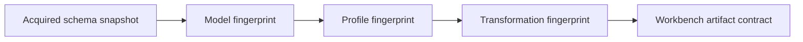

# Profiles and models

Profiles make installation-specific schemas explicit. A profile is an
immutable executable mapping and identity policy bound to one exact model
snapshot. Crosswalk never treats a Drupal field name or an Omeka property as
globally meaningful without that contract.

## Ownership boundary

Crosswalk does not discover a live repository schema while compiling or loading
a profile:

- `sitectl-drupal` owns Drupal configuration acquisition and endpoint
  resolution.
- An Omeka operator or sitectl feature owns acquisition of the bounded Omeka S
  schema snapshot.
- Crosswalk owns deterministic model compilation, ordered Hub mappings,
  identifier rules, fingerprints, storage, and execution.
- Repository imports and other mutations remain sitectl operations.

The split keeps credentials and live-site behavior out of the metadata model
and makes the same reviewed profile reproducible offline.

## Lifecycle

Profile authoring has three explicit steps:

1. `profile create` compiles and stores a content-addressed model, then writes a
   heuristic profile draft. It does not publish guessed mappings.
2. An operator reviews mappings, selectors, codecs, merge policy, and identity
   rules. `profile validate` resolves them against the exact stored model and
   seals a new profile fingerprint.
3. `profile publish` atomically installs the sealed definition. Existing names
   are not overwritten unless `--force` is explicit.

`profile list`, `profile show`, and `profile delete` inspect and manage the
published set. The configuration root defaults to `$HOME/.crosswalk`; pass
`--config-dir` to use another root. Models are stored by fingerprint below
`models/`, while named published profiles live below `profiles/`.

## Drupal

Export active Drupal configuration with sitectl, then pass the directory or
gzip-compressed tar archive to Crosswalk:

```bash
sitectl job run drupal/config-export \
  --output /absolute/path/drupal-config.tar.gz

crosswalk profile create drupal repository-items \
  --config /absolute/path/drupal-config.tar.gz \
  --entity-type node \
  --bundle islandora_object \
  --output repository-items.draft.yaml
```

Review the draft before sealing it. Starter mappings are derived from the
bundle's field storage types, cardinality, settings, labels, descriptions, and
required policy; they are a starting point, not an institutional decision.

```bash
crosswalk profile validate \
  --input repository-items.draft.yaml \
  --output repository-items.sealed.yaml

crosswalk profile publish \
  --input repository-items.sealed.yaml
```

Compilation is local and bounded. Crosswalk reads archive members without
extracting them and does not contact Drupal.

## Omeka S

An Omeka S acquisition snapshot contains the properties, vocabularies,
resource classes, and resource templates needed to build a model. Crosswalk
does not query the Omeka API or database during profile authoring.

Create an installation-wide profile by omitting the template ID, or bind the
profile to one resource template:

```bash
crosswalk profile create omeka-s photographs \
  --snapshot omeka-schema.json \
  --resource-template-id 200 \
  --output photographs.draft.yaml

crosswalk profile validate \
  --input photographs.draft.yaml \
  --output photographs.sealed.yaml

crosswalk profile publish --input photographs.sealed.yaml
```

The current Omeka S adapter is an input adapter. Its profile maps a modeled
resource or resource template into the Hub; it is not an Omeka write contract.

## Institution-specific identifiers

A generic local identifier is not safe duplicate evidence. An institution-owned
identifier becomes exact evidence only when the profile explicitly declares:

- a distinct scheme name;
- an absolute authority namespace URI;
- a fully anchored validation pattern;
- an identity level: `work`, `version`, `manifestation`, `concept`, or
  `source_record`; and
- a `strong` identity rule and modeled lookup field.

For Drupal, the creation flags are:

```bash
crosswalk profile create drupal repository-items \
  --config /absolute/path/drupal-config.tar.gz \
  --entity-type node \
  --bundle islandora_object \
  --institution-attribute local \
  --institution-scheme example-accession \
  --institution-namespace https://repository.example.edu/id/accession/ \
  --institution-pattern '^EX-[0-9]+$' \
  --institution-identity-level source_record \
  --output repository-items.draft.yaml
```

For Omeka S, use `--institution-field` instead of
`--institution-attribute`, plus the same scheme, namespace, pattern, and
identity-level concepts.

The compiled profile canonicalizes identifiers before applying whole-value
patterns. Scheme, namespace, and identity level are all part of exact identity.
Only strong rules enable exact duplicate policy; a built-in scheme omitted from
the profile does not silently retain process-wide exactness. A
`typed-identifier` mapping must use the exact same field selector as at least
one identity rule, although several rules may deliberately classify the same
stored selector.

## Fingerprints and drift

Models, profiles, and profile-bound specs are separate signed-by-content
layers:



Changing executable model or profile policy changes its fingerprint. Loading a
profile requires its exact content-addressed model. A profile-bound spec must
name that exact profile and model, and serializers reject a missing or
mismatched runtime profile. Descriptive profile name/description changes do not
alter executable policy, but a published name is still only an operator-facing
handle—not the trust anchor.

## Systems without profiles

ArchivesSpace currently uses its versioned JSONModel API representation rather
than an installation profile. Hierarchy is carried in Crosswalk's Dataset model
and can become Workbench `id`, `parent_id`, and sibling-weight columns.
Official field structure is validated while newer or plugin-defined top-level
fields are retained as canonical JSON in
`Extra.archivesspace_raw_fields`, including their JSON types and integer
precision.
